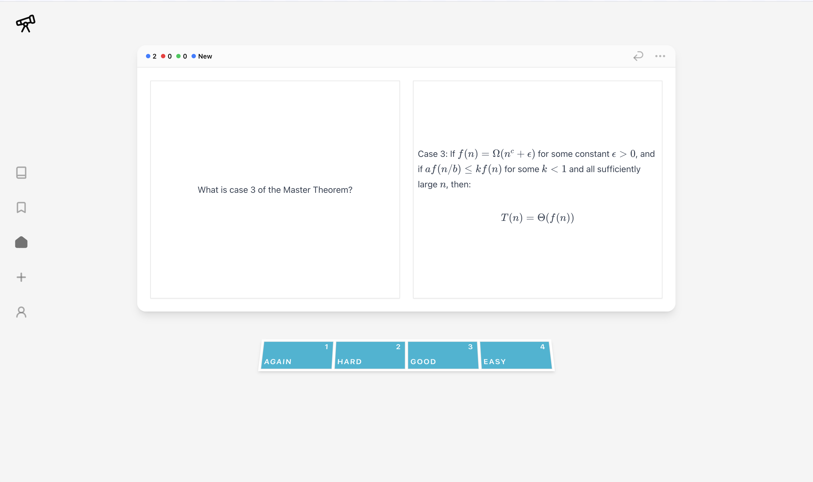
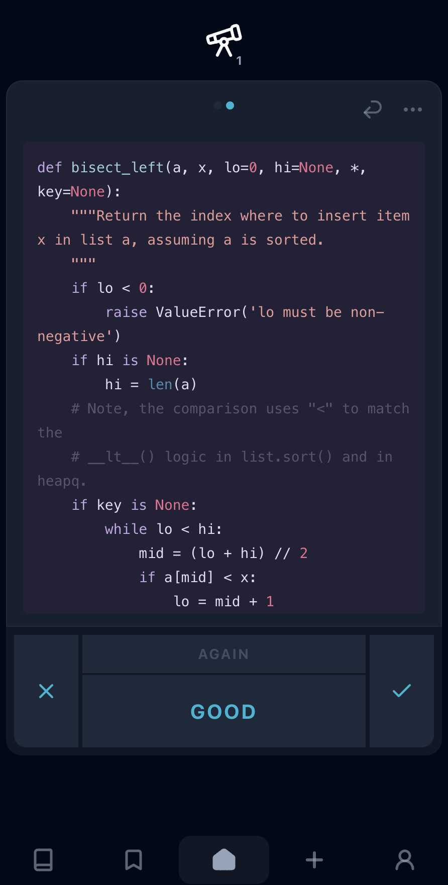
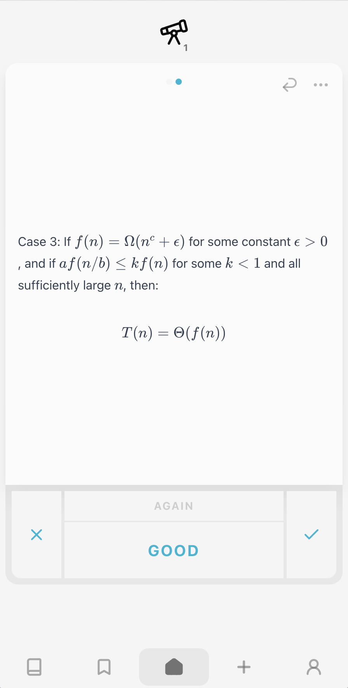
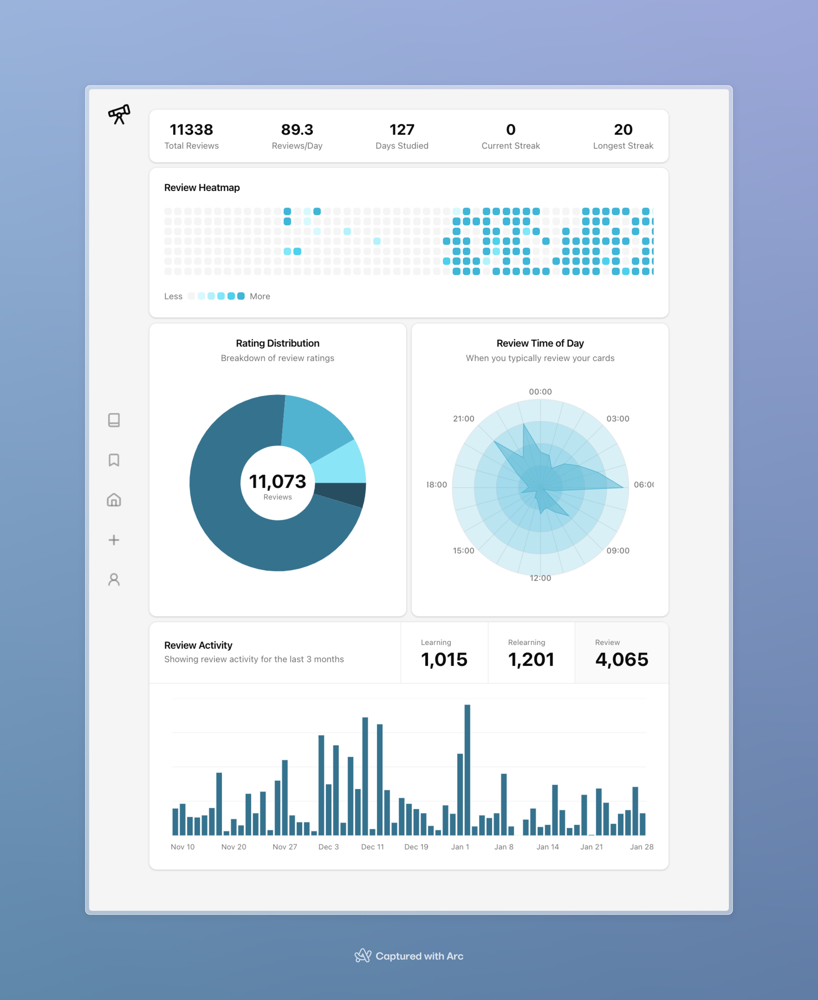

# Spaced

## What is this?

Spaced is a modern flashcard application that uses the Free Spaced Repetition Scheduler (FSRS) algorithm to help you learn efficiently. It's designed to be fast, offline-capable, easy to use, and visually appealing.

### Features

- 📱 **Progressive Web App** - Works offline and installable on both desktop and mobile
- ⚡ **Fast** - Everything is local-first so the UI is fast and responsive
- 🔄 **Sync** - Review cards on desktop or mobile with automatic sync
- 📊 **Rich Statistics** - Track your learning progress with detailed analytics
- 💻 **Modern UI** - Clean, intuitive, hand-crafted UI

### Screenshots

#### Desktop Dark

#### Desktop Light

#### Mobile

  
  

#### Stats

## Why I built this

See [MOTIVATION.md](docs/MOTIVATION.md)
